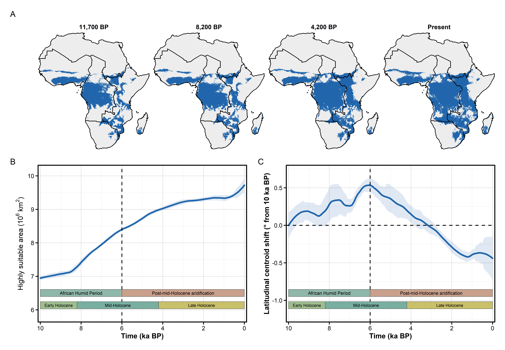

# Climate_Opportunity_Space

This repository contains the code, processed outputs, and generated data products for reconstructing the **Holocene climatic opportunity space** of three African dryland cereals: **sorghum**, **pearl millet**, and **finger millet**.

The project asks where climate could have supported cultivation across Africa from 12 ka BP to the present. It does **not** treat modelled suitability as a direct map of where crops were actually cultivated. Instead, the modelled rasters provide a climate-only baseline for interpreting crop histories, regional constraints, and mismatches between climatic potential and archaeobotanical evidence.

## Main data product

The main generated data product is the set of continuous EcoCrop climatic suitability rasters:

```text
data/processed/ecocrop_rasters/
├── SG/   sorghum
├── PM/   pearl millet
└── FM/   finger millet
```

Each raster represents modelled climatic suitability for one crop and one 100-year Holocene timestep.

```text
0 = unsuitable
1 = optimal climatic suitability
```

File names follow this structure:

```text
<CROP>_suit_t<TIME>.tif
```

For example:

```text
SG_suit_t0.tif      # sorghum, present-day timestep
SG_suit_t60.tif     # sorghum, 6 ka BP
SG_suit_t120.tif    # sorghum, 12 ka BP
```

These rasters are generated from crop physiological thresholds and palaeoclimate data. They should be interpreted as **modelled climatic opportunity surfaces**, not as archaeological crop occurrence maps or yield predictions.

## Representative output

The crop-specific suitability figures summarize how modelled high-suitability area changes through the Holocene. One representative output is shown below (Crop: Sorghum Bicolor).

<p align="center">
  
</p>

## Repository structure

```text
Climate_Opportunity_Space/
├── scripts/      R scripts for the full analysis workflow
├── data/         small input files, processed tables, and generated raster data products
├── outputs/      final figures and tables
└── archive/      local archive of old/intermediate files; not part of the public workflow
```

Each major folder contains its own `README.md` with more specific information about the files inside.

## Scientific workflow

The workflow has five main steps:

1. **Prepare palaeoclimate data**  
Monthly CHELSA-TraCE21k temperature and precipitation data are processed for Africa and organized into crop-model inputs.
2. **Run EcoCrop suitability models**  
Crop physiological thresholds from EcoCrop/FAO are used to model climatic suitability for sorghum, pearl millet, and finger millet.
3. **Generate continuous suitability rasters**  
The model produces crop-specific suitability rasters for each Holocene timestep.
4. **Summarize opportunity space and climate sensitivity**  
The rasters are summarized through time, across African regions, and across suitability thresholds. This includes opportunity-space maps, GAM-based climate-driver analyses, and threshold-sensitivity tests.
5. **Compare with archaeobotanical evidence where possible**  
Southern African archaeobotanical crop records are used as an empirical check on modelled suitability. This comparison is not treated as a full validation exercise because the archaeological data are presence-only, spatially uneven, and restricted in scope.

## Scripts

The main scripts are ordered as follows:

|Script|Purpose|
|-|-|
|`01_climate_data_prep.R`|Prepares palaeoclimate inputs for Africa.|
|`02_ecocrop_model_runs.R`|Runs EcoCrop suitability models and generates crop suitability rasters.|
|`03_parameter_sensitivity.R`|Tests sensitivity to crop physiological parameter uncertainty.|
|`04_threshold_metrics.R`|Recalculates area-weighted suitable-area metrics from continuous rasters.|
|`05_gam_analysis.R`|Runs corrected climate-driver GAM analysis using `prop_0.8`.|
|`06_threshold_sensitivity.R`|Tests how climate sensitivity changes across suitability cutoffs.|
|`07_arch_evaluation.R`|Compares modelled suitability with restricted archaeobotanical evidence.|
|`08_opportunity_space_figures.R`|Generates opportunity-space maps and summary figures.|

More detail is provided in `scripts/README.md`.

## Key outputs

Main figures and tables are stored in:

```text
outputs/figures/
outputs/figures/supplement/
outputs/tables/
```

Important output groups include:

* crop-specific Holocene suitability figures
* climate opportunity-space maps
* parameter-sensitivity figures and tables
* corrected GAM climate-response figures
* threshold-sensitivity results
* aggregate archaeobotanical model-data comparison summaries

## Data availability

### CHELSA-TraCE21k climate data

The original CHELSA-TraCE21k climate rasters are not included in this repository because they are large external data. They should be downloaded separately from the CHELSA data portal:

* https://www.chelsa-climate.org/models/chelsa-trace21k
* https://www.chelsa-climate.org/datasets/chelsa-trace21k-centennial

The repository contains scripts and processed outputs derived from these data, but not the full raw CHELSA-TraCE21k archive.

### Archaeobotanical data

The raw archaeobotanical dataset used in `07_arch_evaluation.R` is not included in this repository because it has not yet been openly published/licensed. The dataset contains site-level crop occurrence information, including location and chronological information.

The data can be made available upon reasonable request to the corresponding author. Exact rerunning of the archaeobotanical evaluation requires access to this restricted input file.

## Reproducibility notes

The repository is organized so that the main workflow can be followed from scripts `01` to `08`. However, some steps require external or restricted data:

* raw CHELSA-TraCE21k climate data must be downloaded externally;
* restricted archaeobotanical data are available only upon request;
* large generated raster products may be included in `data/processed/ecocrop_rasters/` as the main data product.

For most users, the easiest entry points are:

```text
data/processed/ecocrop_rasters/     # main modelled suitability rasters
outputs/figures/                    # final figures
outputs/tables/                     # final summary tables
scripts/                            # reproducible analysis workflow
```

## Contact

### Mudit Joshi  
**Primary contact**  
Section for Ecoinformatics & Biodiversity  
Aarhus University  
mjoshi@bio.au.dk

### Alejandro Ordonez  
**Supervisor**  
Section for Ecoinformatics & Biodiversity  
Aarhus University  
alejandro.ordonez@bio.au.dk
